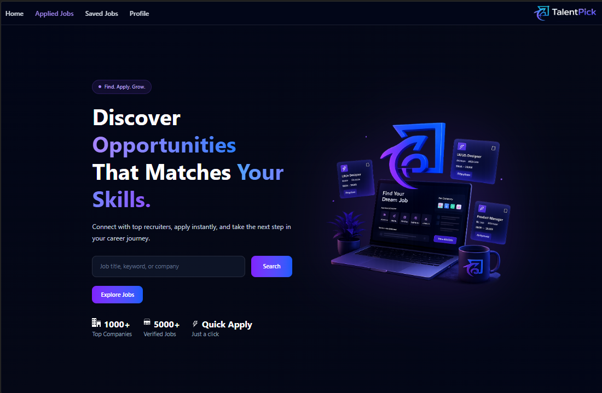
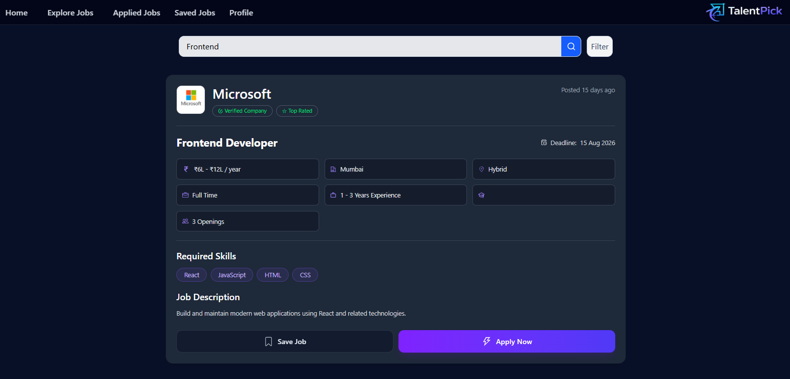
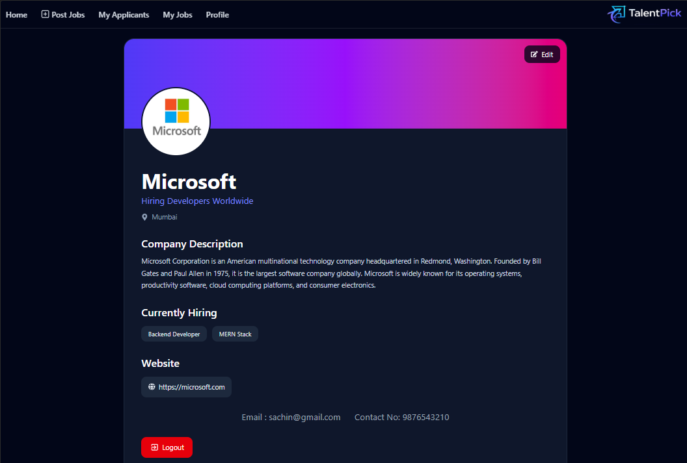
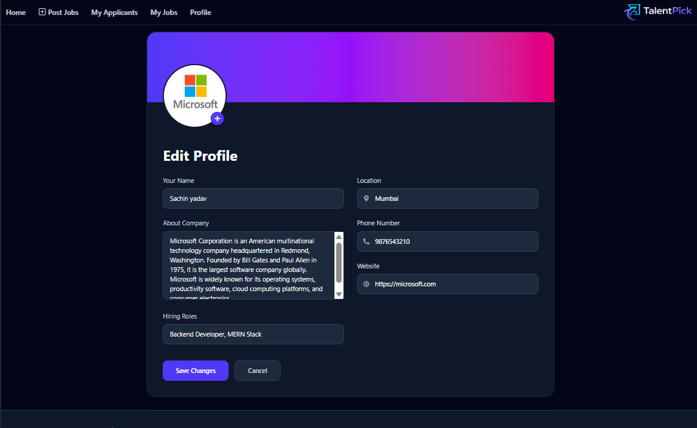
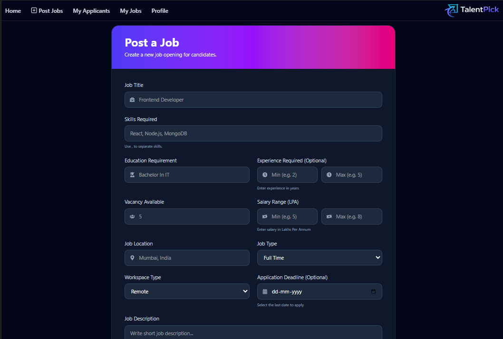
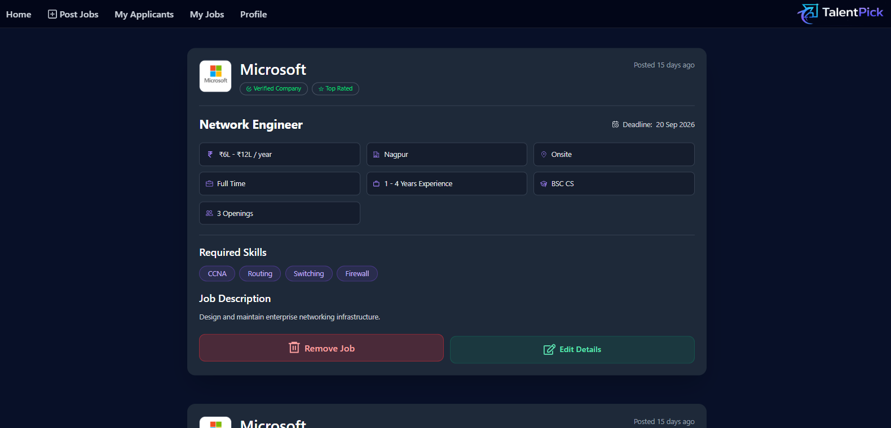
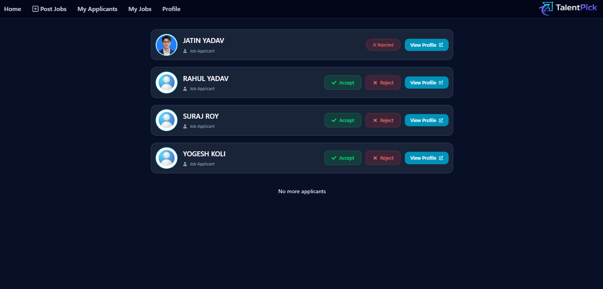
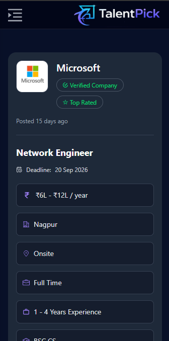

# TalentPick 💼

TalentPick is a full-stack MERN-based job portal designed to bridge the gap between job seekers and recruiters through a streamlined and user-friendly platform. The application provides secure authentication, profile management, job posting capabilities, and a responsive user experience, enabling users to efficiently discover opportunities and manage their professional presence.

---

## 🌐 Live Demo

**Application:** https://talentpick.duckdns.org

---

## Screenshots

### Home Page



### Search Jobs



### User Profile



### Edit Profile



### Post Job



### My Jobs



### Applicant Tracking



### Mobile View



---
## Features

### 🔐 Authentication & Authorization

* Secure user registration and login
* JWT-based authentication
* Role-based access control (Candidate & Recruiter)
* Protected routes
* Password encryption using bcrypt

### 👤 User Profile Management

* Create and manage professional profiles
* Update personal and professional information
* Upload and update profile picture
* Upload and update resume
* Cloudinary integration for media storage
* Recruiters can view candidate profiles and resumes

### 💼 Job Management

#### Candidate Features

* Browse all available jobs
* Search jobs by title or keywords
* Filter jobs by location and category
* Apply for jobs
* Save jobs for later
* Track applied jobs

#### Recruiter Features

* Create job postings
* Update existing job listings
* Delete job postings
* View all posted jobs
* Track applicants for each job
* Accept or reject job applications
* View applicant profiles and resumes

### 🛡️ Security

* JWT Authentication
* Password hashing using bcrypt
* Protected API routes
* API rate limiting
* Input validation
* Environment variable protection
* Secure authentication workflow

### 🎨 Frontend Experience

* Responsive user interface
* Modern UI built with Tailwind CSS
* React Router-based navigation
* Context API for state management
* Optimized user interactions
* Clean and intuitive user experience

---

### Authentication & Authorization

- Secure user registration and login
- JWT-based authentication
- Protected routes
- Role-based access control
- Password encryption using bcrypt

### User Profile Management

- Create and manage user profiles
- Update personal and professional information
- Profile image upload and management
- Cloudinary integration for image storage

### Job Management

- Create job postings
- Update existing job listings
- Delete job postings
- View jobs created by the user
- Browse and explore available jobs

### Security

- API rate limiting
- Input validation and sanitization
- Environment variable protection
- Secure authentication workflow

### Frontend Experience

- Responsive user interface
- React Router-based navigation
- Context API for state management
- Optimized user interactions

---

## Technology Stack

### Frontend

- React.js
- React Router DOM
- Axios
- Context API
- Taiwind CSS

### Backend

- Node.js
- Express.js

### Database

- MongoDB
- Mongoose

### Authentication & Security

- JSON Web Token (JWT)
- bcrypt.js
- Express Rate Limit
- CORS
- dotenv

### Cloud Services

- Cloudinary

---

### Deployment

- Microsoft Azure Virtual Machine (Ubuntu)
- Docker
- Docker Compose
- Nginx Reverse Proxy
- Let's Encrypt SSL
- DuckDNS

---

## Project Structure

```bash
TalentPick
│
├── backend
│   ├── config
│   ├── controllers
│   ├── middlewares
│   ├── models
│   ├── routes
│   ├── utils
│   ├── validators
│   ├── .env
│   ├── .dockerignore
│   ├── Dockerfile
│   ├── package.json
│   ├── package-lock.json
│   └── server.js
│
├── frontend
│   ├── public
│   ├── src
│   │   ├── components
│   │   ├── contexts
│   │   ├── pages
│   │   ├── index.css
│   │   └── main.jsx
│   │
│   ├── .env.production
│   ├── .dockerignore
│   ├── Dockerfile
│   ├── package.json
│   ├── package-lock.json
│   ├── vite.config.js
│   ├── eslint.config.js
│   └── index.html
│
├── deployment
│   ├── DEPLOYMENT.md
│   └── nginx.conf
│
├── Screenshots
│
├── compose.yaml
│
├── .gitignore
│
└── README.md
```

---

## Getting Started

### Prerequisites

Ensure the following are installed on your system:

- Node.js
- npm
- MongoDB Atlas or Local MongoDB

---

## Installation

### Clone the Repository

```bash
git clone https://github.com/sachinyadav0907/TalentPick.git
```

```bash
cd TalentPick
```

### Install Backend Dependencies

```bash
cd backend
npm install
```

### Install Frontend Dependencies

```bash
cd ../frontend
npm install
```

---

## Environment Variables

Create a `.env` file inside the `backend` directory and configure the following variables:

```env
PORT=5000

MONGO_URI=your_mongodb_connection_string

JWT_SECRET=your_jwt_secret

CLOUDINARY_CLOUD_NAME=your_cloud_name
CLOUDINARY_API_KEY=your_api_key
CLOUDINARY_API_SECRET=your_api_secret
```

---

## Running the Application

### Start Backend Server

```bash
cd backend
npm start
```

### Start Frontend Development Server

```bash
cd frontend
npm run dev
```

The frontend will be available at:

```bash
http://localhost:5173
```

The backend server will run at:

```bash
http://localhost:5000
```
---

# Docker Deployment

## Build Backend Image

```bash
cd backend
docker build -t talentpick-backend:latest .
```

## Build Frontend Image

```bash
cd frontend
docker build -t talentpick-frontend:latest .
```

## Run using Docker Compose

```bash
docker compose up -d
```

## Stop Containers

```bash
docker compose down
```

---

## Core Functionalities

* JWT Authentication & Role-Based Authorization
* Candidate & Recruiter Role Management
* Professional Profile Management
* Profile Picture Upload
* Resume Upload & Management
* Cloudinary Integration
* Job Posting & Management
* Job Search & Filtering
* Saved Jobs
* Apply for Jobs
* Applicant Tracking System
* Accept & Reject Applications
* Recruiter Profile Access
* Protected API Routes
* Responsive Frontend Design
* State Management using Context API

---

## Future Enhancements

* Admin Dashboard
* Real-Time Chat Between Recruiters & Candidates
* Modern UI/UX Improvements
* Email Notifications
* CI/CD Pipeline using GitHub Actions
* Redis Caching
* Interview Scheduling
* Real-Time Notifications
* Analytics Dashboard

---

# Production Deployment

The application is deployed on a Microsoft Azure Ubuntu Virtual Machine using Docker containers managed with Docker Compose. Nginx acts as a reverse proxy to serve the React frontend and forward API requests to the Express backend. HTTPS is enabled using Let's Encrypt SSL certificates, and the application is accessible through a DuckDNS domain.

### Deployment Stack

- Azure Virtual Machine (Ubuntu)
- Docker
- Docker Compose
- Nginx Reverse Proxy
- Let's Encrypt SSL
- DuckDNS
- MongoDB Atlas

### Architecture

```
Internet
      │
      ▼
HTTPS (DuckDNS + SSL)
      │
      ▼
Nginx
 ├──────────────┐
 │              │
 ▼              ▼
React        Express
Frontend     Backend
(Container) (Container)
      │
      ▼
MongoDB Atlas
```
---

## License

This project is licensed under the MIT License.

---

## Author

**Sachin Yadav**

BSc Information Technology Student  
MERN Stack Developer | DevOps Enthusiast

If you found this project useful, consider giving it a star ⭐ on GitHub.
